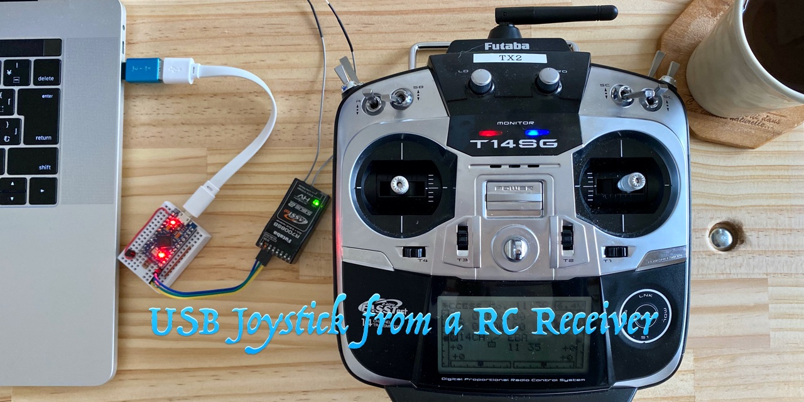
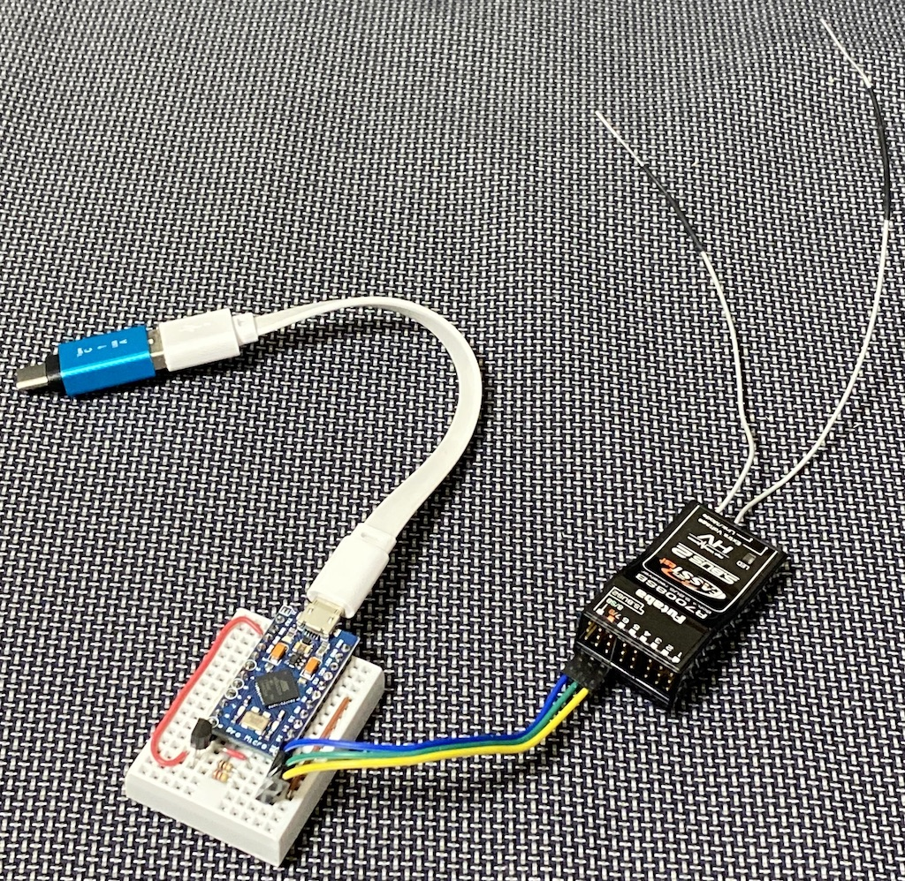
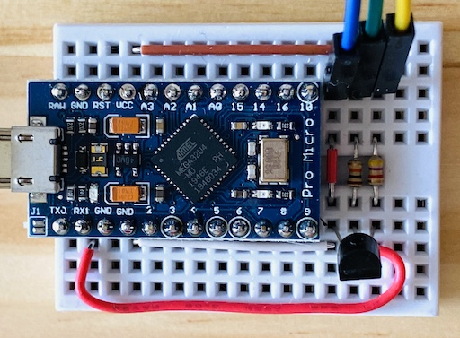
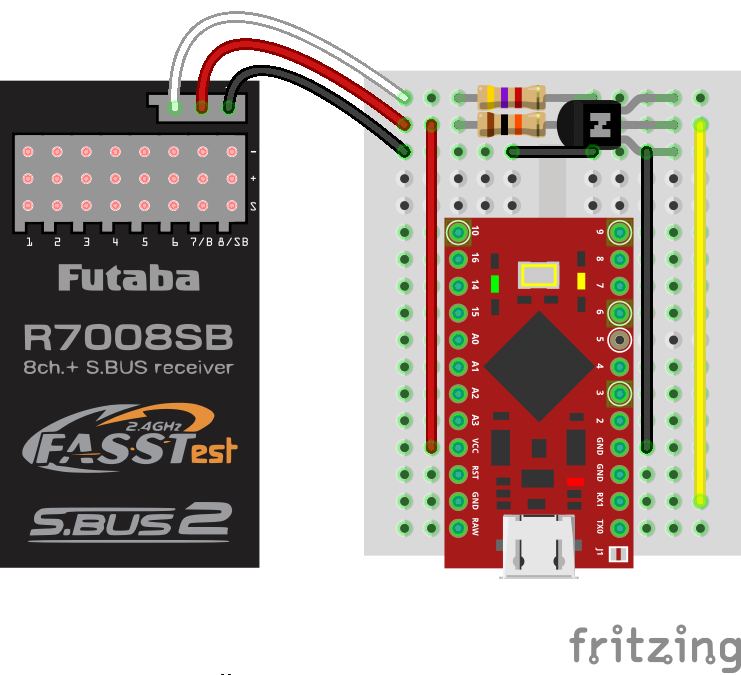
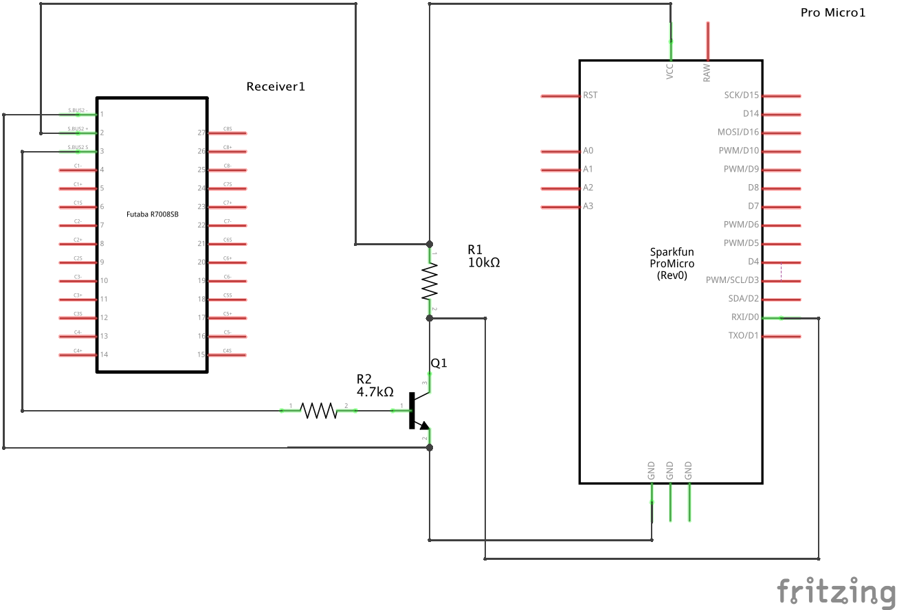
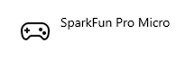
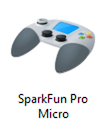
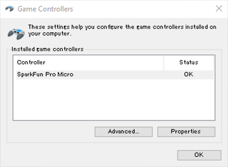
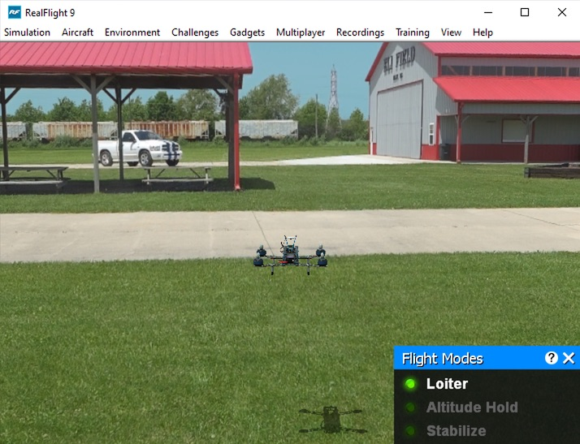

# S.BUS受信機USBジョイスティック変換
Date: 2020/04/20

## 概要
ドローンシミュレーターをUSBのジョイスティックとして使用するためのものです。MS-Windows 10 (1909)上のRealFlight9で動作確認しました。

完成写真

ブレッドボード写真

## 使用機材
- [双葉電子工業 14SG（14ch-2.4GHz FASSTestモデル）](https://www.rc.futaba.co.jp/propo/air/14sg.html)
- [双葉電子工業 R7008SB](https://www.rc.futaba.co.jp/reciever/air01/r7008sb.html)
- [Arduino互換 SparkFun Pro Micro (ATMega32U4 5V 16MHz) (中華互換品)](https://www.shigezone.com/?product=arduino-pro-micro%e4%ba%92%e6%8f%9b%e3%83%9c%e3%83%bc%e3%83%89)
- [トランジスタ2SC1815L-GR 60V150mA](http://akizukidenshi.com/catalog/g/gI-06477/)
- [カーボン抵抗(炭素皮膜抵抗) 1/6W 4.7kΩ](http://akizukidenshi.com/catalog/g/gR-16472/)
- [カーボン抵抗(炭素皮膜抵抗) 1/6W 10kΩ](http://akizukidenshi.com/catalog/g/gR-16103/)
- [ミニブレッドボード BB-601(白)](http://akizukidenshi.com/catalog/g/gP-05155/)

## ソフトウェア
- Arduino IDE 1.8.12
- macOS 10.15.4
- MS-Windows 10 1909 (Parallels Desktop 15)

## ハードウェア
ミニブレッドボードに図のように配置します。

レシーバーから出ているS.BUSの信号はUARTを反転したもだそうです。
[ここ](https://ardupilot.org/copter/docs/common-sbus-out.html#connecting-servos-to-a-serial-port)にあるようにNPNトランジスタで反転させて、Arduino Pro MicroのRX(Serial1)に接続します。ここではR2に4.7kΩを使ってますが、3.3kΩや1kΩでも使えると思います。

## 準備
### Arduino IDE 設定
1. Arduino IDEのPreferencesの **追加のボードマネージャーのURL** に以下の１行を追加します。
    https://raw.githubusercontent.com/sparkfun/Arduino_Boards/master/IDE_Board_Manager/package_sparkfun_index.json
1. メニューのツール > ボードを **SparkFun Pro Micro** にします。
1. ツール > プロセッサを **ATMega32U4 (5V, 16 MHz)** にします。
1. ツール > シリアルポートを対象のものに変更します。

### ライブラリ追加
追加のライブラリを `libraries` にコピーします。macOSでデフォルトなら、 `~/Documents/Arduino/libraries` でした。
- [Arduino Joystick Library](https://github.com/MHeironimus/ArduinoJoystickLibrary)
- [bolderflight S.BUS Library](https://github.com/bolderflight/SBUS)
    - *IDEのライブラリマネージャからインストールできますが、そちらはArduino Pro Microに対応していない古いものなので使いません。*

## プロポのアナログ値
プロポの設定（モード、チャンネルなど）に合わせて適宜ソースコード内の値を変更します。
### スティック、スライドレバー
ジョイスティックのXAxis, YAxis, Throttle, Rudderに設定します。

プロポのエンドポイントをこのように設定した場合です。
|No.|name|CCW,L,T|||CW,R,B|
|:--:|:--:|--:|--:|:--|:--|
|1|AIL|135|120|122|135|
|2|ELE|135|120|122|135|
|3|THR|135|120|122|135|
|4|RUD|135|120|122|135|

トリムが0の場合の値
||min|cener|max|
|:--:|--:|--:|--:|
|取得値|205|1024|1843|
|相対値|-819|0|819|

Trimを動かすと±4くらい動き最大±50でした。
リンケージメニューのサブトリムは±240でした。
これらを変えていると中央値やエンドポイントがずれるので、自分の使用環境に合わせて調整してください。

||min|cener|max|
|:--:|--:|--:|--:|
|取得値|224|1024|1824|
|相対値|-800|0|800|

### 2ポジションのスイッチ
1024と1696の中間あたりを閾値にしてボタンのオン・オフを判定します。
||OFF|ON|
|:--:|--:|--:|
|取得値|1024|1696|
|相対値|0|672|

### 3ポジションのスイッチ
ジョイスティックのボタンでは2値なので、3値を使いたい場合はZAxisなどアナログ値が扱える項目に割り当てます。
||0|1|2|
|:--:|--:|--:|--:|
|取得値|352|1024|1696|
|相対値|-672|0|672|

## ソースコード

Arduino Pro Microは、micro USBにSerial、ピンのRXとTXがSerial1です。
RXにR7008SBを接続するので、Serial1をパラメータとしてSBUSクラスインスタンスを作ります。

~~~C++
SBUS sbus(Serial1);
~~~

Joystickのインスタンスを作ります。HIDのタイプに `JOYSTICK_TYPE_MULTI_AXIS` を設定すると、
Windowsではゲームコントローラとして認識してくれません。
プロポのモード設定や、AxisやRudderなど、アプリに合わせて使うものを選択します。
プロポなのでハットスイッチはありません。

~~~C++
Joystick_ Joystick(
  JOYSTICK_DEFAULT_REPORT_ID, // hidReportId
  JOYSTICK_TYPE_JOYSTICK,     // joystickType
  BUTTON_COUNT,               // buttonCount
  0,                          // hatSwitchCount
  true,                       // includeXAxis
  true,                       // includeYAxis
  false,                      // includeZAxis
  false,                      // includeRxAxis
  false,                      // includeRyAxis
  false,                      // includeRzAxis
  true,                       // includeRudder
  true,                       // includeThrottle
  false,                      // includeAccelerator
  false,                      // includeBrake
  false);                     // includeSteering
~~~

`setup()` で、スティックのアナログ値の下限・上限を決めます。

~~~C++
  Joystick.setXAxisRange(224, 1824);
  Joystick.setYAxisRange(224, 1824);
  Joystick.setThrottleRange(224, 1824);
  Joystick.setRudderRange(224, 1824);
~~~

引数を `false` にします。 `sendState()` をコールしたタイミングでUSBに送信されます。

~~~C++
  Joystick.begin(false);
~~~

`loop()` でS.BUSで送信されたデータをデコードしてUSBに送信します。
S.BUSのボーレートは100,000で、10msごとに送信されているようです。

## PCへ接続
HIDのジョイスティックとして **設定** の **デバイス** に表示されたら成功です。
デバイス名は **SparkFun Pro Micro** です。
これはArduinoのブートローダーで決められているので、ユーザーが書き換えることは容易ではありません。

**コントロールパネル** の **デバイスとプリンター** だと、こんな感じで追加されます。

次はキャリブレーションします。
スタートメニューで **game con** と途中まで入力すると、 **Set up USB Game Controllers** が候補に出てくるので選択します。（コントロールパネルのアイコン **SparkFun Pro Micro** から開くこともできます。）
プロパティダイアログにキャリブレーションがあるので、そこで指示通りに調整します。

RealFlight 9を起動して、コントローラーの設定したら練習することができました。

## さいごに

お疲れさまでした。
ケーブルを必要としないので大変快適ですし、マイプロポで操作できるので練習に良いです。
同じことをできる商品は中国通販サイトをみるとありますが、ソースコードがあるので自分で調整できるのがよいです。
ここまで読んでいただき、ありがとうございます。
